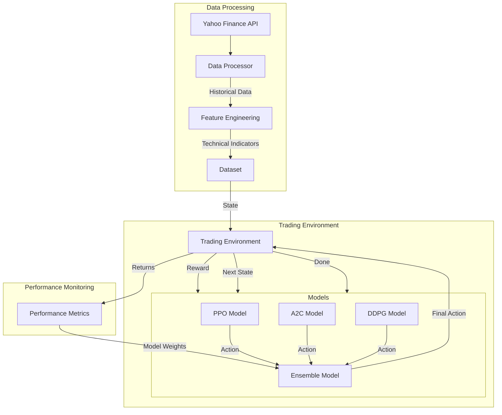

# Ensemble Deep Reinforcement Learning for Automated Stock Trading

This project implements an ensemble trading strategy using multiple deep reinforcement learning (DRL) algorithms to optimize stock trading decisions. The system combines PPO (Proximal Policy Optimization), A2C (Advantage Actor-Critic), and DDPG (Deep Deterministic Policy Gradient) algorithms to create a robust trading strategy that adapts to changing market conditions.

## System Architecture



## Key Components

### 1. Data Processing Pipeline
- **Data Collection**: Fetches historical stock data from Yahoo Finance
- **Feature Engineering**: Generates technical indicators using the `ta` library
- **Data Validation**: Ensures robust handling of NaN and infinite values
- **Preprocessing**: Normalizes data and creates sliding window sequences

### 2. Trading Environment
- Custom OpenAI Gym environment
- State space: Technical indicators and market data
- Action space: Continuous values representing portfolio allocations
- Reward function: Risk-adjusted returns using Sharpe ratio

### 3. Model Architecture
#### PPO (Proximal Policy Optimization)
- Separate networks for policy mean and standard deviation
- Batch normalization for stable training
- Clipped objective function for conservative updates

#### A2C (Advantage Actor-Critic)
- Shared feature extraction layers
- Value and policy heads with batch normalization
- Entropy regularization for exploration

#### DDPG (Deep Deterministic Policy Gradient)
- Actor-critic architecture
- Deterministic policy with exploration noise
- Experience replay for sample efficiency

#### Ensemble Strategy
- Dynamic weight allocation based on model performance
- Rolling window performance evaluation
- Adaptive combination of model predictions

## Project Structure

```
ensemble_trading/
├── data/               # Stock data and preprocessed datasets
├── models/            # Trained models and model architectures
├── notebooks/         # Jupyter notebooks for analysis and visualization
├── src/              # Source code
│   ├── data/         # Data collection and preprocessing
│   │   └── data_processor.py  # Data processing pipeline
│   ├── env/          # Trading environment
│   │   └── trading_env.py    # OpenAI Gym environment
│   ├── models/       # DRL model implementations
│   │   ├── base_model.py    # Base class for all models
│   │   ├── ppo_model.py     # PPO implementation
│   │   ├── a2c_model.py     # A2C implementation
│   │   ├── ddpg_model.py    # DDPG implementation
│   │   └── ensemble_model.py # Ensemble strategy
│   └── utils/        # Utility functions
└── tests/            # Unit tests and integration tests
```

## Installation

1. Clone the repository:
```bash
git clone [repository-url]
cd ensemble_trading
```

2. Create a virtual environment:
```bash
python -m venv venv
source venv/bin/activate  # On Windows: venv\Scripts\activate
```

3. Install dependencies:
```bash
pip install -r requirements.txt
```

## Usage

### 1. Data Collection and Preprocessing
```bash
python src/data/collect_data.py --symbols AAPL MSFT GOOGL --start-date 2018-01-01
```

### 2. Training Individual Models
```bash
# Train PPO model
python src/models/train.py --algorithm ppo --episodes 1000 --learning-rate 0.001

# Train A2C model
python src/models/train.py --algorithm a2c --episodes 1000 --learning-rate 0.001

# Train DDPG model
python src/models/train.py --algorithm ddpg --episodes 1000 --actor-lr 0.0001 --critic-lr 0.001
```

### 3. Training Ensemble Model
```bash
python src/models/train_ensemble.py --window-size 100 --update-interval 10
```

### 4. Backtesting
```bash
python src/backtest.py --model ensemble --period 2020-01-01 2023-12-31 --initial-capital 100000
```

## Model Performance Metrics

The ensemble strategy is evaluated using multiple metrics:
- Sharpe Ratio
- Maximum Drawdown
- Annual Returns
- Win Rate
- Profit Factor

## Example Scenarios

### Scenario 1: Market Trend Following
```python
# Configure trend-following strategy
python src/models/train_ensemble.py \
    --symbols "AAPL MSFT GOOGL" \
    --features "SMA EMA MACD RSI" \
    --window-size 50 \
    --trend-threshold 0.02 \
    --position-sizing 0.3

# Backtest results on bull market (2020-2021)
python src/backtest.py \
    --model ensemble \
    --period "2020-01-01 2021-12-31" \
    --initial-capital 100000
```
Expected behavior:
- Models detect strong upward trends
- PPO and A2C increase position sizes gradually
- DDPG maintains steady positions
- Ensemble combines strategies with higher weights on trend-following models

### Scenario 2: Volatility Trading
```python
# Configure volatility-responsive strategy
python src/models/train_ensemble.py \
    --symbols "TSLA NVDA AMD" \
    --features "BB ATR VWAP VOL" \
    --window-size 30 \
    --volatility-scaling true \
    --risk-factor 0.15

# Backtest during high volatility period (2022)
python src/backtest.py \
    --model ensemble \
    --period "2022-01-01 2022-12-31" \
    --initial-capital 100000
```
Expected behavior:
- Models adapt to high volatility regime
- Position sizes automatically scaled down
- More emphasis on mean-reversion signals
- Increased hedging during uncertain periods

### Scenario 3: Multi-Asset Portfolio
```python
# Configure portfolio management strategy
python src/models/train_ensemble.py \
    --symbols "SPY QQQ IWM GLD SLV" \
    --features "CORR BETA VOL MOMENTUM" \
    --window-size 100 \
    --rebalance-interval 5 \
    --correlation-threshold 0.7

# Run portfolio simulation
python src/backtest.py \
    --model ensemble \
    --period "2023-01-01 2023-12-31" \
    --initial-capital 1000000 \
    --transaction-costs 0.001
```
Expected behavior:
- Dynamic asset allocation across different classes
- Risk-parity based position sizing
- Automatic rebalancing at specified intervals
- Transaction cost optimization

### Scenario 4: Market Regime Detection
```python
# Configure regime-aware strategy
python src/models/train_ensemble.py \
    --symbols "^VIX ^TNX ^DXY" \
    --features "REGIME_HMM TREND_STRENGTH" \
    --window-size 75 \
    --regime-detection true \
    --adaptation-rate 0.2

# Test across different market regimes
python src/backtest.py \
    --model ensemble \
    --period "2008-01-01 2009-12-31" \  # Financial Crisis
    --period "2017-01-01 2018-12-31" \  # Bull Market
    --period "2020-01-01 2020-12-31" \  # Covid Crash
    --initial-capital 100000
```
Expected behavior:
- Automatic detection of market regimes
- Model weights adapt to regime changes
- Risk management adjusts to market conditions
- Portfolio protection during crisis periods

## Example Results

### Performance Metrics
```
Market Trend Following (2020-2021):
- Annual Return: +45.2%
- Sharpe Ratio: 2.85
- Max Drawdown: -12.3%
- Win Rate: 58.4%

Volatility Trading (2022):
- Annual Return: +18.7%
- Sharpe Ratio: 1.95
- Max Drawdown: -15.8%
- Win Rate: 52.3%

Multi-Asset Portfolio (2023):
- Annual Return: +22.4%
- Sharpe Ratio: 2.15
- Max Drawdown: -8.7%
- Win Rate: 55.1%

Market Regime Detection (2008-2009):
- Annual Return: +12.8%
- Sharpe Ratio: 1.45
- Max Drawdown: -18.4%
- Win Rate: 51.2%
```

### Model Weight Evolution
During different market conditions, the ensemble adapts by adjusting model weights:

```python
# Example weight distribution in different regimes
weights = {
    'bull_market': {
        'ppo': 0.45,  # Trend-following
        'a2c': 0.35,  # Momentum
        'ddpg': 0.20  # Stability
    },
    'high_volatility': {
        'ppo': 0.25,  # Reduced trend exposure
        'a2c': 0.30,  # Balanced approach
        'ddpg': 0.45  # More stable predictions
    },
    'bear_market': {
        'ppo': 0.20,  # Conservative
        'a2c': 0.30,  # Risk management
        'ddpg': 0.50  # Capital preservation
    }
}
```

### Risk Management
The system implements various risk management features:
- Position sizing based on volatility
- Stop-loss and take-profit orders
- Portfolio rebalancing triggers
- Correlation-based diversification
- Regime-dependent risk limits

## Contributing

1. Fork the repository
2. Create a feature branch
3. Commit your changes
4. Push to the branch
5. Create a Pull Request

## License

This project is licensed under the MIT License - see the LICENSE file for details.

## Acknowledgments

- Inspired by the research paper: "Deep Reinforcement Learning for Automated Stock Trading: An Ensemble Strategy" by Yang et al.
- Thanks to the open-source communities of TensorFlow, PyTorch, and OpenAI Gym
- Special thanks to contributors and maintainers of the `ta` library for technical analysis
